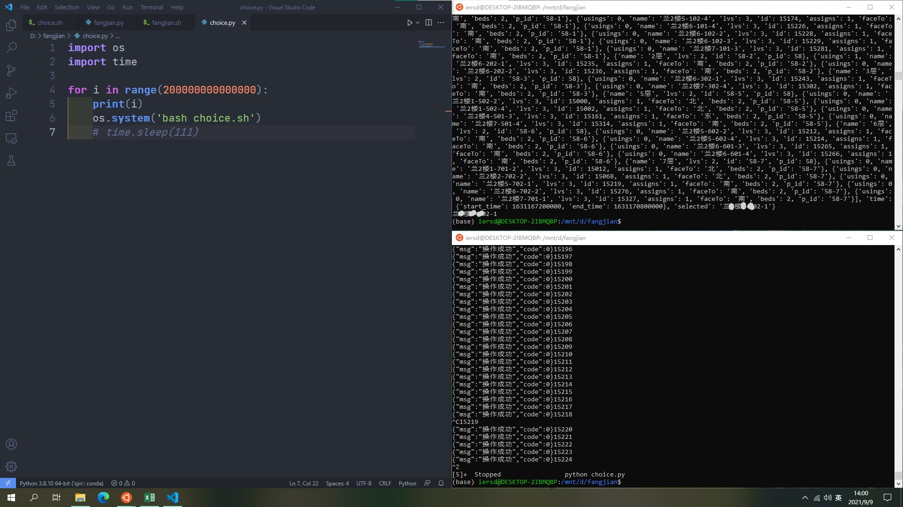

# CUMT_Dorm
视频介绍：https://www.bilibili.com/video/BV1e64y1h7an
## 从网页登录获取 Token 信息
1. 登录 http://gongyu.cumt.edu.cn/m/index.jsp
2. 右键-检查（ Chrome 内核类型浏览器可以按 `F12` ）
3. 打开 `网络` 选项卡
4. 进入选房功能界面，在 `网络` 的资源中得到请求 `getAssign` 时 post 过去的 `Token` 和 `Cookie` 信息

## 获取含有房间信息的 JSON 文件
若在 Linux 环境下用 `curl` 请求，可参考如下 `fangjian.sh`，注意修改 `Token` 和 `Cookie` 内容
```sh
curl 'http://gongyu.cumt.edu.cn/DormBatch/getAssign' \
-X 'POST' \
-H 'Content-Type: application/json' \
-H 'Accept: application/json, text/plain, */*' \
-H 'Accept-Language: zh-cn' \
-H 'Accept-Encoding: gzip, deflate' \
-H 'Host: gongyu.cumt.edu.cn' \
-H 'Origin: http://gongyu.cumt.edu.cn' \
-H 'Content-Length: 2' \
-H 'User-Agent: Mozilla/5.0 (Macintosh; Intel Mac OS X 10_15_7) AppleWebKit/605.1.15 (KHTML, like Gecko) Version/14.1.2 Safari/605.1.15' \
-H 'Referer: http://gongyu.cumt.edu.cn/m/index.html?ssoCode=YAjGnTa+3kV5w6edB80QwA==' \
-H 'Connection: keep-alive' \
-H 'Cookie: JSESSIONID=92E0809CBC25642790220E7A7D406CFA; bocms_visite_user_session=9C98CE07675D8C0751AD040B5328944A' \
-H 'X-Requested-With: XMLHttpRequest' \
-H 'token: 91737_e2xxxxxxxxxxxxxxxxxxxxxcaf_mobile' \
--data-binary '{}' \
--output 'fangjian.json'
```
> 也可以直接从浏览器查看或下载

## 解析 JSON 文件，查看候选房间代码
这里是把 JSON 文件转为表格查看的，其实直接看 JSON 文件也是可以的  
**里面有网页上并未显示的朝向信息**
```py
import json
import pandas as pd

df = pd.DataFrame(columns=['id','name','faceTo','assigns','beds','usings'])
with open('fangjian.json','r') as j:
    jj = json.load(j)
jjj = jj['data']

lv3 = []
for i in range(len(jjj)):
    if jjj[i]['lvs'] == 3:
        df.loc[len(df)] = [jjj[i]['id'],jjj[i]['name'],jjj[i]['faceTo'],jjj[i]['assigns'],jjj[i]['beds'],jjj[i]['usings']]

df.to_excel('fangjian.xlsx')
```
> 最好多准备几个要选择的 `id`

## 构造选择房间的请求
同样在 Linux 环境下用 `curl` 请求，可参考如下 `choice.sh`，注意修改 `Token` 和 `Cookie` 内容  
同时在 `dormId` 中填写你首选的房间号
```sh
curl 'http://gongyu.cumt.edu.cn/DormBatch/setAssign' \
-X 'POST' \
-H 'Content-Type: application/json' \
-H 'Accept: application/json, text/plain, */*' \
-H 'Accept-Language: zh-cn' \
-H 'Accept-Encoding: gzip, deflate' \
-H 'Host: gongyu.cumt.edu.cn' \
-H 'Origin: http://gongyu.cumt.edu.cn' \
-H 'Content-Length: 16' \
-H 'User-Agent: Mozilla/5.0 (Macintosh; Intel Mac OS X 10_15_7) AppleWebKit/605.1.15 (KHTML, like Gecko) Version/14.1.2 Safari/605.1.15' \
-H 'Referer: http://gongyu.cumt.edu.cn/m/index.html?ssoCode=YAjGnTa+3kV5w6edB80QwA==' \
-H 'Connection: keep-alive' \
-H 'Cookie: JSESSIONID=4B74A42A3FD4806A4302D54667A573CC; bocms_visite_user_session=9C98CE07675D8C0751AD040B5328944A' \
-H 'X-Requested-With: XMLHttpRequest' \
-H 'token: 91737_e2xxxxxxxxxxxxxxxxxxxxxcaf_mobile' \
--data-binary '{"dormId":15035}' \
--output -
```
> 这时候不要在浏览器页面上操作了，但如果提示 Token 失效之类的就赶紧去重新获取吧

## 循环请求以选择该房间
在选房开始时间之前就放心大胆地拼命请求(*^_^*)
```py
import os
for i in range(66666666666):
    print(i)
    os.system('bash choice.sh')
```
    
## 查看是否选中房间 
以防网页仍无法进入，可以再次查看房间的 JSON 看是否选中
也就是再次请求 `fangjian.sh` 获取 JSON 文件，并查看最后的位置


## 为啥写得这么乱？
懒呗，能用就行啦！
- [ ] 用 requestes 把 post 请求的内容重写，这样各计算机平台均可使用
